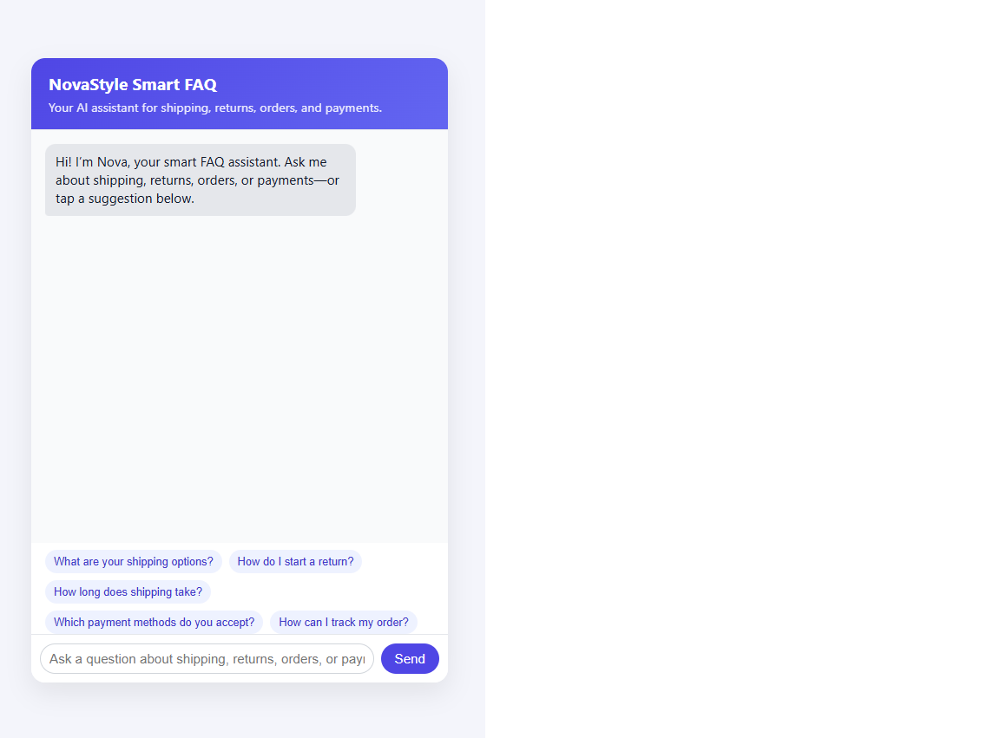
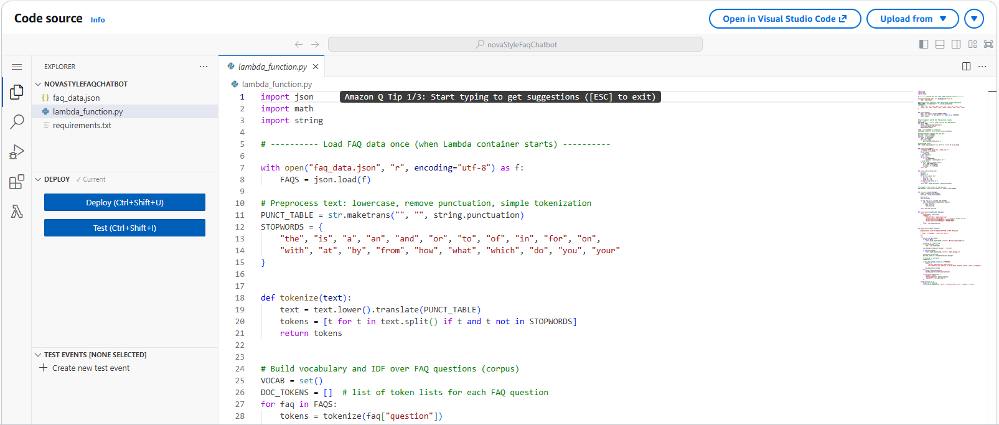
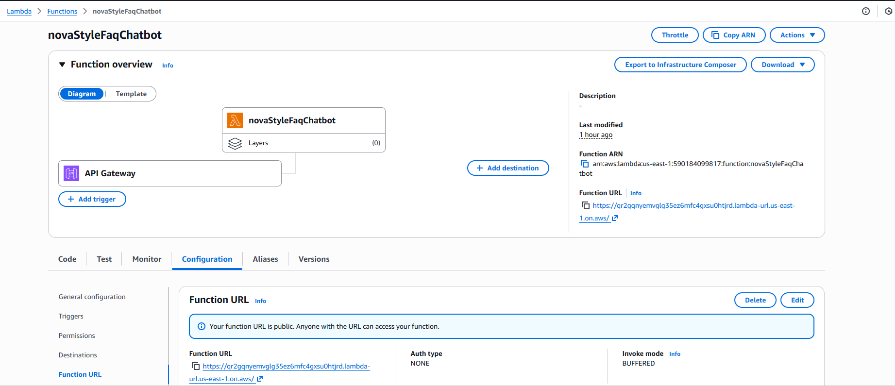
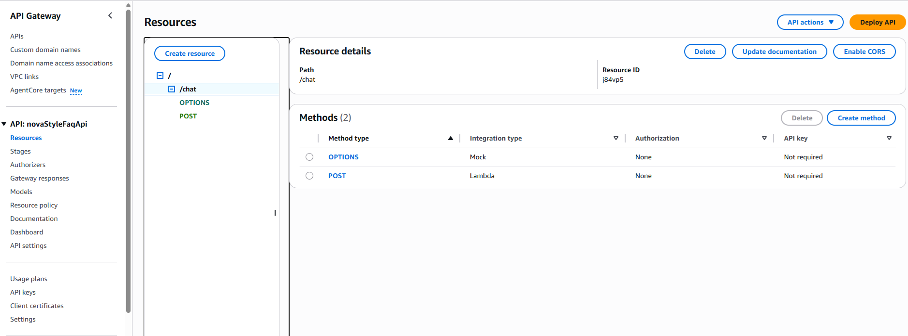
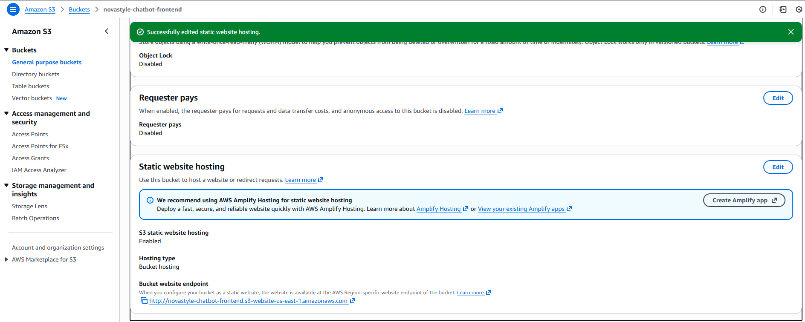

# NovaStyle Smart FAQ Chatbot 🧠💬

Serverless AI-powered FAQ chatbot built using **AWS Lambda + API integration + HTML/CSS/JavaScript frontend**.

This project simulates a smart customer-support assistant that answers questions about
shipping, returns, orders, and payments — similar to what you see on large e-commerce websites.

---

## 🚀 Features

✔ Interactive chatbot UI (HTML, CSS, JavaScript)  
✔ Backend logic hosted on **AWS Lambda**  
✔ JSON-based FAQ knowledge base  
✔ Supports suggested quick-reply buttons  
✔ Handles errors & unavailable network states  
✔ Deployed frontend on Amazon S3 (static website)

---

## 🏗 Architecture

Frontend (browser)
⬇
JavaScript `fetch()` request
⬇
AWS Lambda (Python backend)
⬇
Returns JSON chatbot answer

Simple, scalable, and **serverless** — no servers to manage.

---

## 📁 Project Structure

---

```text
smart-faq-chatbot/
│
├── backend/ # AWS Lambda Python backend
│ ├── faq_data.json
│ ├── lambda_function.py
│ └── requirements.txt
│
├── frontend/ # Web chatbot UI
│ ├── index.html
│ ├── style.css
│ └── app.js
│
├── assets/ # Screenshots & deployment images
│
└── lambda_package.zip # Deployment package (for Lambda)
```


---

---

## 🖼 Screenshots

### Chatbot UI


### AWS Lambda Function


### Lambda Public URL


### AWS Resources View


### S3 Static Website


---

## 🧠 Technologies Used

### Backend
- Python (AWS Lambda)
- JSON data store

### Frontend
- HTML
- CSS
- JavaScript

### Cloud
- AWS Lambda
- AWS S3 (static hosting)
- API Gateway (optional)

---

## 🎯 What I Learned

✔ Deploying serverless applications  
✔ Working with AWS Lambda  
✔ Structuring clean backend + frontend projects  
✔ Handling API calls from JavaScript  
✔ Debugging deployment issues  

This project helped me gain hands-on experience with **cloud, serverless, and full-stack workflows**.

---

## 📌 Future Improvements

🔲 Add DynamoDB storage  
🔲 Add authentication  
🔲 Add chatbot conversation history  
🔲 Replace static FAQ with AI-generated answers

---

## 📧 Contact

If you’d like to discuss this project, feel free to connect:

**Anastasiya Kotelnikova**  
MS in Data Science @ NJIT  
GitHub: https://github.com/AnastasiyaKotelnikova  
Portfolio: https://anastasiyakotelnikova.github.io/Portfolio/

